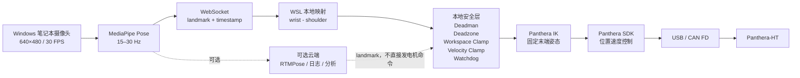
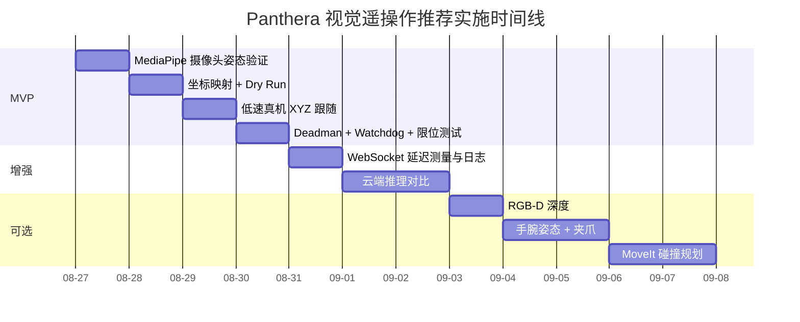

# Panthera-HT 视觉人体姿态遥操作可行性与最小实现报告

## 执行摘要

**结论：可行，而且你现有的 Panthera-HT、笔记本摄像头和当前 Windows + WSL 环境已经足够做出第一版。** 不需要额外相机、不需要训练神经网络，也不必一开始部署 ROS 2 / MoveIt。Panthera 官方 Python SDK 已经提供正/逆运动学、位置速度控制、超时检测，并且官方仓库本身已经存在“VR 手柄位姿 → 笛卡尔末端遥操作”的实现：手柄位置控制末端位置，`Squeeze` 充当 deadman/clutch，松开后机械臂停止运动并保持当前位置。这与“摄像头手腕位置 → 末端 XYZ”在控制架构上高度同构，因此不存在底层能力缺口。citeturn16view0turn19view0turn19view1

推荐的第一版不是“人体肩关节角映射到 J1、肘关节角映射到 J2”，而是：

\[
\text{笔记本 RGB 摄像头}
\rightarrow
\text{MediaPipe Pose}
\rightarrow
(\mathbf p_{\rm wrist}-\mathbf p_{\rm shoulder})
\rightarrow
\text{相对位移映射}
\rightarrow
\text{目标末端 XYZ}
\rightarrow
\text{Panthera IK}
\rightarrow
\text{J1--J6}
\]

这条路径最简单、鲁棒性最好，也直接符合当前机器人遥操作研究中“直接映射人体末端/肢端运动到机器人笛卡尔末端”的思路。Panthera 官方 SDK 当前提供 `inverse_kinematics()`；官方 ROS 2 节点也已经提供 `/move_to_pose` 的 XYZ+RPY 笛卡尔接口和 KDL IK。citeturn16view0turn17view2

**MVP 建议全部本地计算。** Windows 直接使用笔记本摄像头运行 MediaPipe Pose，15–30 Hz 输出右肩、右腕 landmark；通过 WebSocket 向 WSL 发送几十到几百字节的 landmark 数据；WSL 内运行唯一的 Panthera 控制进程，在本地完成坐标映射、安全限制、IK 和执行。MediaPipe 的 BlazePose 系列本来就是为单摄像头实时推理设计，原始 BlazePose 工作报告在 Pixel 2 上已能超过 30 FPS；当前 Pose Landmarker 提供专门的 `LIVE_STREAM` 异步 API 和 33 个身体 landmark。citeturn12academia36turn13search0turn13search6

**云端是第二阶段，而不是第一阶段。** 云端适合以后换 HRNet、RTMPose/RTMW3D 等更重模型，但安全过滤、消息超时、workspace 限制和最终机器人执行必须留在机器人本地。遥操作文献一致表明通信延迟会损害操作性能；尤其是与本项目相似的 mimicry-control 研究发现“动作开始延迟”比单纯机器人运动较慢更难被操作者适应。较新的实验也在约 100–200 ms 开始观察到操作者对延迟的明显感知，并在约 200–300 ms 出现显著性能退化，因此本报告把 **≤120 ms** 设为理想端到端工程目标、**250 ms stale timeout** 设为建议的首版冻结阈值；这不是 Panthera 官方安全参数，而是保守的软件设计目标。citeturn14search2turn14academia34

最大的技术限制不是机械臂，而是**单目深度**。MediaPipe Pose 确实会输出 `pose_world_landmarks`，官方定义为以髋部中点为原点、单位为米的 3D world landmarks；但这些 Z 坐标来自单目神经网络估计，而不是实际深度传感器测距。单幅 RGB 的 3D 姿态存在固有几何歧义，因此第一版应该降低前后方向的缩放比例，并把它当“人体运动控制量”而不是精密测量值。citeturn12search17turn12academia37turn12search4

Panthera 本体也明确**没有自动避障和环境感应传感器**；厂商要求空旷、视距内操作和完整系统风险评估。因此视觉跟随系统不能假设“机器人会自己躲人/躲桌子”，安全层必须由你的软件和实验布置负责。fileciteturn0file0 fileciteturn0file1

**最终推荐路线：**

| 阶段 | 推荐实现 | 是否现在就做 |
|---|---|---|
| MVP | Windows 摄像头 + MediaPipe Pose + WebSocket + WSL Python SDK IK + 固定末端姿态 + 手腕 XYZ 跟随 | **是** |
| 增强版 | 云端姿态估计、滤波、网络时延统计、动态缩放 | MVP 稳定后 |
| 进阶版 | D405/其他深度相机、手掌朝向、6D 位姿、夹爪手势 | 可选 |
| ROS/MoveIt 版 | ROS 2 + MoveIt 碰撞场景、轨迹规划 | 需要环境/障碍规划时再做 |

## 可行性、技术选型与关键限制

### Panthera 控制端已经具备所需能力

Panthera 官方资料把该机械臂定义为 6 自由度、860 mm 工作半径、3.5 kg 峰值负载、CAN FD 控制的平台；官方资料同时提供 Python/C++ SDK、ROS 2、URDF、MoveIt2、Gazebo 和 `ros2_control` 资源。官方参数手册给出的关节最大速度约为 57.3°/s，末端最大运动速度为 0.8 m/s。fileciteturn0file0 fileciteturn0file1

当前官方 Python SDK 的能力恰好覆盖 MVP 所需部分：

```text
get_current_pos()
forward_kinematics()
inverse_kinematics(target_position, target_rotation, init_q)
Joint_Pos_Vel(...)
moveJ(...)
set_timeout(...)
set_stop()
```

SDK 还明确实现了关节位置限制、力矩限制、超时检测和位置到达检测。citeturn16view0

更有说服力的是，官方 Python 仓库已经包含：

```text
7_keyboard_cartesian_pos_control.py
7_vr_cartesian_control.py
7_vr_dual_cartesian_control.py
6_moveL_pos_control.py
```

其中 VR 版本从 UDP 5005 收手柄位姿，按 `Squeeze` 激活控制，移动手柄控制末端位置，旋转手柄控制末端姿态，松开 `Squeeze` 后停止运动并保持当前位置。也就是说，你现在要做的核心工作不是重新设计机器人控制器，而是把“VR controller pose”替换成“MediaPipe wrist pose”。citeturn19view0turn19view1

你的机器当前也已经实际验证了：

```text
/dev/ttyACM0 ... /dev/ttyACM6
All motor connections are normal
Control loop started at 200 Hz
```

因此“Windows → usbipd → WSL → CANboard → 7 个电机”的真机链路已经打通。这里剩下的是高层遥操作问题，而不是驱动问题。

### 人体姿态库比较

对于**单人、笔记本摄像头、只跟踪肩/腕、追求低延迟**的目标，MediaPipe 是明显最精简的 MVP 方案。

| 方案 | 实时性 | 典型精度侧重点 | 主要依赖 | Python API / 平台 | 单目直接输出 3D landmark | 对本项目评价 |
|---|---|---|---|---|---|---|
| **MediaPipe Pose Landmarker / BlazePose** | **高**；BlazePose 原论文在移动设备即达到实时水平 | 单人身体实时追踪 | MediaPipe Tasks；无需完整 PyTorch/CUDA 栈 | **有**；跨平台 | **有**，33 个 landmark，含 world XYZ | **MVP 首选**。最少依赖、低延迟、直接有肩腕 XYZ。citeturn12academia36turn13search0turn13search6 |
| OpenPose | GPU 下可实时，但部署明显更重 | 多人 2D、身体/手/脸组合 | Caffe/CUDA/OpenCL 等 | Python + C++；Windows/Linux/macOS | **单摄像头主体输出为 2D**；官方 3D 模块依靠多相机三角化 | 不适合首版；多人或已有 OpenPose 体系时考虑。citeturn12academia38turn0search0 |
| HRNet（MMPose） | 相对较重；笔记本 CPU 不宜作为低延迟首选 | 高分辨率 2D keypoint 精度 | PyTorch + MMCV/MMPose | **有 Python**；主要 Linux/GPU 生态 | 标准 HRNet Pose 本身是 **2D** | 研究/精度基准很好，但对“只取一个腕点”过度设计。citeturn10academia36turn10search0 |
| RTMPose / RTMW3D（MMPose） | **高，尤其 GPU/部署优化后** | 现代实时 pose / whole-body | PyTorch/MMPose，部署栈比 MediaPipe 重 | **有 Python** | MMPose 当前已有实时 3D whole-body 系列 | 云端增强版值得试；MVP 不需要。citeturn10search0 |

OpenPose 原始工作本身强调的是实时**多人 2D**姿态；官方项目虽然提供 3D reconstruction 功能，但其 3D 模式依赖多个同步视角做三角测量，不能把它等同于 MediaPipe 的单目 learned 3D landmark。citeturn12academia38turn0search0

HRNet 的核心贡献是始终保持高分辨率特征表示，以获得更精确的 2D keypoint heatmap；它非常适合需要高精度 benchmark 的任务，但你这里只需要稳定地找到肩和腕，增加 GPU、PyTorch、MMPose 等依赖带来的收益有限。citeturn10academia36turn10search0

因此本项目的选择可以非常明确：

> **MVP：MediaPipe Pose；云端重模型实验：RTMPose/RTMW3D；OpenPose 与 HRNet 不作为首发方案。**

### 单目深度的边界

MediaPipe 当前 Pose Landmarker 会同时输出：

```text
pose_landmarks
    x, y ∈ 图像归一化坐标
    z = 相对深度

pose_world_landmarks
    x, y, z = world coordinates
    单位：m
    原点：髋部中点
```

官方说明中，普通 landmarks 的 Z 也是以髋中点深度为原点，值越小意味着越靠近摄像头；world landmarks 则给出米单位的 3D 坐标。citeturn12search17turn13search3

但是这里必须避免一个常见误解：

> `world_landmarks.z` **不是 RealSense 那样的实际深度读数**。

BlazePose GHUM 确实能够从**单张 RGB**估计 3D 人体姿态，但“单目图像 → 真实 3D”的问题天然存在尺度、视角和遮挡歧义。Google 的相关研究也明确指出 2D 投影对应的 3D 姿态存在固有 ambiguity。citeturn12academia37turn12search4

因此第一版应该：

```text
左右移动   → 正常增益
上下移动   → 正常增益
前后移动   → 小增益 + 更强滤波
```

而不是相信：

```text
MediaPipe wrist.z 改变 0.20 m
→ Panthera 必须精确移动 0.20 m
```

### 本地与云端的取舍

本地推理最大的优点不是算力，而是**没有网络反馈延迟**。MediaPipe `LIVE_STREAM` API 是异步的：输入带单调递增时间戳，API 会立即返回；当处理跟不上时，它会主动丢弃输入帧以降低总体延迟，而不是积累越来越老的帧。这正是实时遥操作想要的行为。citeturn13search0

云端计算在以下情况下才有明显价值：

```text
需要更重的 HRNet / RTMPose / 3D model
或
笔记本本地推理速度不足
或
要集中记录、评估多个客户端
```

但云端不应该承担最终安全控制。视觉/姿态服务器可以返回 landmark 或目标 XYZ；**workspace clamp、速度限制、stale-message watchdog、IK 和急停接口留在机械臂所在电脑。**

通信可以用 WebSocket。WebSocket 标准建立在 TCP 上，提供单连接的双向消息通信；公网场景应使用 TLS 保护的 `wss`。citeturn15search0

对于本项目，建议的工程延迟预算是：

| 链路 | MVP 目标 | 可接受退化区间 | 建议故障动作 |
|---|---:|---:|---|
| 摄像头 → landmark | 30–60 ms | <100 ms | 跳过旧帧 |
| landmark → 本地安全层 | <10 ms | <20 ms | 丢弃乱序消息 |
| IK + 指令生成 | <10–20 ms | <30 ms | IK 失败则保持 |
| **本地总端到端** | **≤100–120 ms** | 120–200 ms | 降低 gain |
| **云端总端到端** | **≤150 ms** | 150–200 ms | 自动降低 gain |
| 新数据年龄 | <100 ms | 100–250 ms | >250 ms **立即冻结新目标** |

这些数字是本项目的**设计预算而非 Panthera 厂商阈值**。它们采取了偏保守的策略：teleoperation 研究显示延迟会增加操作难度，而类似 mimicry-control 系统尤其受动作开始延迟影响；另一项 0–500 ms 的实验在 100–200 ms 已开始观察延迟感知，在 200–300 ms 出现明显性能下降。citeturn14search2turn14academia34

## 最小材料清单与运行环境

### 硬件

MVP 不需要再买东西。

| 必要项 | 你当前情况 | 替代项 / 备注 |
|---|---|---|
| Panthera-HT + 通用控制盒 + 24 V 电源 | 已有 | 必须牢固固定；官方要求空旷环境。fileciteturn0file0 |
| Windows 笔记本 | 已有 | 同一台电脑即可 |
| 笔记本 RGB 摄像头 | 已有 | 任意 UVC USB 摄像头 |
| USB 数据连接 | 已打通 | 当前 `caf1:ffff` 已进入 WSL |
| 物理停止手段 | 机械臂/控制盒 | 软件急停不能替代可触及的物理停止手段 |

**可选增强件**只有深度相机。Panthera 官方资料甚至明确提供 D405 相机支架，并列出 D405 作为自主拓展配件，因此硬件设计本身预留了 RGB-D 扩展方向。fileciteturn0file0

不过对于“看操作者手臂”的任务，D405 应该放在**操作者前方/笔记本附近**，而不是机械臂腕部；机械臂上的相机支架更适合以后做机器人第一视角抓取。

### 软件

MVP 建议保持现在的 Panthera Python 环境，不迁移 ROS：

```text
Windows
├── Python 3.x
├── OpenCV
├── MediaPipe
└── websockets

WSL
├── 当前 panthera conda 环境
├── Panthera Python SDK
├── numpy
└── websockets
```

当前官方 Panthera SDK 推荐独立 conda 环境，Python 3.9/3.10/3.12 均有支持说明；其预编译 wheel 主要针对 Ubuntu 22 编译，其他系统官方建议必要时从源码编译。你的 Ubuntu 26.04 环境已经通过现有后端成功工作，因此没有必要为 MVP 重装。citeturn16view0

**ROS/MoveIt 目前反而有版本问题。** 你上传的 2026 年 7 月 Panthera 资料库把资源标成“ROS2-JAZZY”，但**当前官方 GitHub 仓库今天明确要求 Ubuntu 22.04 + ROS 2 Humble**。fileciteturn0file1 citeturn17view0

所以对于你现在的 Ubuntu 26.04：

> **不要为了首版视觉遥操作强行装 Panthera ROS2 Humble。**

以后确实需要 MoveIt 碰撞规划时，推荐单独建立 Ubuntu 22.04 / ROS 2 Humble 环境，而不是破坏现在已经工作的 SDK 环境。当前官方 ROS 仓库的 MoveIt、硬件驱动和 `panthera_arm_control` 都按 22.04/Humble 提供依赖与启动指令。citeturn17view0turn17view1

### USB、权限与 WSL

当前 usbipd 官方/Microsoft 推荐流程是：

管理员 PowerShell，一次性共享：

```powershell
usbipd list
usbipd bind --busid 5-2
```

普通 PowerShell，每次需要连接 WSL 时：

```powershell
usbipd attach --wsl --busid 5-2
usbipd list
```

WSL：

```bash
lsusb
ls -l /dev/ttyACM*
```

你应继续看到：

```text
/dev/ttyACM0
/dev/ttyACM1
...
/dev/ttyACM6
```

Microsoft 明确指出 `bind` 需要管理员权限，而 `attach` 不需要；USB 设备 attach 到 WSL 后 Windows 暂时不能使用该设备，并且所有 WSL 2 distribution 均可以看到它。citeturn17view4

一个很重要的 WSL 限制是：

> **bind 是持久的，但 attach 不是。**

usbipd-win 官方说明，设备重启、USB 物理拔插或系统重启后需要重新 `attach`。所以以后视觉遥操作突然出现 `/dev/ttyACM*` 消失，第一检查项不是 MediaPipe，而是：

```powershell
usbipd list
```

再重新：

```powershell
usbipd attach --wsl --busid 5-2
```

citeturn18view2

串口权限则推荐官方 ROS 仓库采用的 `dialout` 做法：

```bash
sudo usermod -aG dialout $USER
```

然后重新登录 WSL。这比长期 `chmod 777 /dev/ttyACM*` 更合理；官方 ROS 仓库也推荐 `dialout`。citeturn17view0

### 网络与权限

本地版只需 Windows → WSL 的本机通信，不需要公网服务器。

云端版最少需要：

```text
稳定网络
公网 HTTPS/WSS 入口
TLS 证书
客户端认证 token
服务器 Python 环境
GPU（仅在使用重模型时需要）
```

WebSocket 支持文本和二进制消息；公网必须优先 `wss://`，并在服务器端验证身份和所有输入，不能把来自网络的 XYZ 直接视为可信运动命令。WebSocket 标准本身也明确提醒服务器不能假定客户端输入可信。citeturn15search0

## 系统架构与坐标映射

### 推荐架构



Panthera 官方现成 VR 遥操作也是“外部位姿数据流 → 本地 Cartesian controller → 机械臂”的结构，且明确使用一个按键作为 clutch/deadman；因此这里把视觉 landmark 替换为 VR 位姿属于相同的控制范式。citeturn19view0turn19view1

### 不需要做严格的“相机外参标定”

第一版有一个非常重要的简化：

**你不需要知道摄像头在机器人基座坐标系中的真实 6D 外参。**

因为我们不是要问：

> “我的手在真实房间里的绝对 XYZ 是多少？”

而是：

> “从我按下启用键开始，我的手向右/上/前移动了多少，机器人也按比例向相应方向移动。”

设人体坐标中的：

\[
\mathbf d_h(t)
=
\mathbf p_{\rm wrist}(t)
-
\mathbf p_{\rm shoulder}(t)
\]

在按下 deadman/clutch 的瞬间记录：

\[
\mathbf d_{h0}
\]

同时记录机械臂当前末端：

\[
\mathbf p_{r0}
\]

以后机器人命令是：

\[
\boxed{
\mathbf p_{\rm cmd}(t)
=
\mathbf p_{r0}
+
\mathbf A
\left[
\mathbf d_h(t)-\mathbf d_{h0}
\right]
}
\]

其中：

\[
\mathbf A = \mathbf S \mathbf P
\]

`P` 负责轴交换和正负方向，例如“画面向右 → 机器人 +Y”；`S` 负责缩放。


这里的关键好处是：**每次按下 deadman 都重新建立人体零点和机器人零点**，所以不需要保证你永远站在摄像头同一位置。这个设计也与 Panthera 官方 VR 控制中的 clutch 思想高度一致。citeturn19view1

### 首版建议的缩放和安全包络

建议第一轮真机测试使用非常保守的值：

```python
GAIN_X = 0.30
GAIN_Y = 0.30
GAIN_Z = 0.15    # 单目深度最不可信，所以更小

MAX_X_FROM_START = 0.10   # m
MAX_Y_FROM_START = 0.10
MAX_Z_FROM_START = 0.08

MAX_CART_SPEED = 0.10     # m/s
DEADZONE = 0.005          # m，机器人目标空间
COMMAND_RATE = 20         # Hz
STALE_TIMEOUT = 0.250     # s
```

这些不是 Panthera 厂商参数，而是**首轮实验的保守起点**。机械臂官方末端最大速度达到 0.8 m/s，因此把视觉遥操作首版限制在 0.10 m/s，相当于只使用硬件最大指标的一小部分。fileciteturn0file0

特别建议把 workspace 做成“以激活瞬间位置为中心的小盒子”：

```text
                 +Z
                  ↑
          ┌──────────────┐
         /              /|
        /  最大 ±8 cm   / |
       ┌──────────────┐  |
       │      ● p0    │  |
       │              │  |
       │   ±10 cm     │ /
       └──────────────┘
          ±10 cm
```

这样即使相机误检，也不可能一次把机器人目标甩到 70 cm 外的另一个工作区。

Panthera 官方资料还列出了腕部、肘部、肩部和边界奇异位姿，因此所有 IK 失败、突然出现极大关节变化或靠近工作空间边缘的目标都应**拒绝执行而不是强行截断关节角**。fileciteturn0file1

### 为什么姿态先固定

MVP 只跟踪：

```text
x, y, z
```

而让：

```text
roll, pitch, yaw = 激活瞬间的末端姿态
```

即：

\[
R_{\rm cmd}(t)=R_0
\]

这样 IK 只需改变位置，不会因为单目手腕姿态估计抖动而让 J4–J6 快速旋转。

等 XYZ 稳定后，再用手掌的 index / pinky / thumb landmark 建立手掌坐标系，才增加 orientation。MediaPipe Holistic/Hand Landmarker 能进一步输出手部 landmark 和 hand world landmarks，因此这个增强路线是现成的。citeturn12search13turn13search7

## 分阶段实施步骤与必要代码

### MVP：本地视觉，只跟随右手腕 XYZ

**目标：一天左右得到第一台“你动手，它动末端”的机器。**

输入：

```text
笔记本摄像头 RGB
```

输出：

```text
Panthera 末端 XYZ
orientation 固定
夹爪不动
```

推荐频率：

```text
Camera        30 FPS
MediaPipe     15–30 Hz
WebSocket     15–30 Hz
Robot target  20 Hz
```

MediaPipe Live Stream 模式允许丢帧，因此绝不能设计“每个摄像头 frame 必须执行一个机器人动作”的队列；永远使用**最新一帧**。citeturn13search0

#### Windows 侧 MediaPipe 快速示例

先安装：

```powershell
py -m pip install mediapipe opencv-python websockets
```

从 MediaPipe 官方 Pose Landmarker 页面取得 `.task` 模型文件并保存为：

```text
pose_landmarker.task
```

然后最小测试程序：

```python
import time
import cv2
import mediapipe as mp

BaseOptions = mp.tasks.BaseOptions
PoseLandmarker = mp.tasks.vision.PoseLandmarker
PoseLandmarkerOptions = mp.tasks.vision.PoseLandmarkerOptions
RunningMode = mp.tasks.vision.RunningMode

RIGHT_SHOULDER = 12
RIGHT_WRIST = 16

latest = None


def on_result(result, output_image, timestamp_ms):
    global latest

    if not result.pose_world_landmarks:
        latest = None
        return

    lm = result.pose_world_landmarks[0]
    shoulder = lm[RIGHT_SHOULDER]
    wrist = lm[RIGHT_WRIST]

    confidence = min(shoulder.visibility, wrist.visibility)

    latest = {
        "t_ms": timestamp_ms,
        "shoulder": [shoulder.x, shoulder.y, shoulder.z],
        "wrist": [wrist.x, wrist.y, wrist.z],
        "confidence": confidence,
    }


options = PoseLandmarkerOptions(
    base_options=BaseOptions(model_asset_path="pose_landmarker.task"),
    running_mode=RunningMode.LIVE_STREAM,
    num_poses=1,
    min_pose_detection_confidence=0.6,
    min_pose_presence_confidence=0.6,
    min_tracking_confidence=0.6,
    result_callback=on_result,
)

cap = cv2.VideoCapture(0)

with PoseLandmarker.create_from_options(options) as detector:
    while cap.isOpened():
        ok, frame = cap.read()
        if not ok:
            break

        rgb = cv2.cvtColor(frame, cv2.COLOR_BGR2RGB)

        mp_image = mp.Image(
            image_format=mp.ImageFormat.SRGB,
            data=rgb,
        )

        # MediaPipe 要求相邻 LIVE_STREAM 时间戳单调递增。
        ts_ms = time.monotonic_ns() // 1_000_000
        detector.detect_async(mp_image, ts_ms)

        if latest is not None:
            print(latest)

cap.release()
```

当前 MediaPipe 官方 Python API明确要求 LIVE_STREAM 使用 `result_callback`，输入 timestamp 必须单调递增，并且为了控制 latency 允许主动 drop frame。右肩/右腕属于其 33 个标准 pose landmarks。citeturn13search0turn13search1turn13search6

**这一阶段先不要接机械臂。**

你只需要验证：

```text
手向右  → wrist.x 有稳定变化
手向上  → wrist.y 有稳定变化
手前后  → wrist.z 能变化，但明显比 XY 更飘
```

#### WebSocket 数据格式

不要传机器人电机命令，只传 landmark：

```json
{
  "v": 1,
  "type": "human_pose",
  "seq": 1843,
  "t_capture_ms": 218345367,
  "hand": "right",
  "shoulder": [0.132, -0.274, -0.081],
  "wrist": [0.387, -0.413, -0.216],
  "confidence": 0.97
}
```

必要字段只有：

```text
seq
timestamp
shoulder XYZ
wrist XYZ
confidence
```

时间戳非常关键，它让机器人侧能够判断：

```text
这个数据是刚生成的
还是网络堵塞后迟到 400 ms 的旧命令
```

WebSocket 的 TCP 双向连接很适合这种低带宽状态流。citeturn15search0

#### 先做 dry-run 映射

机器人侧暂时不要发命令，只打印：

```text
Human relative:
[ 0.12, -0.08, 0.03 ]

Robot target:
[ 0.402, 0.051, 0.327 ]

age:
31 ms

deadman:
OFF
```

先用手测试各轴方向，直到映射符合直觉。

例如发现：

```text
手向右 → robot Y 应该减小
手向上 → robot Z 应该增加
手向前 → robot X 应该增加
```

就定义：

```python
P = np.array([
    [ 0,  0, -1],   # human Z -> robot X
    [-1,  0,  0],   # human X -> robot Y
    [ 0, -1,  0],   # human Y -> robot Z
])
```

**不要复制这个矩阵当绝对答案。** 你应通过三次“右、上、前”动作实际确定符号，因为摄像头镜像设置和人体 landmark 坐标方向可能改变你期望的控制手感。MediaPipe 官方定义了 landmark/world-landmark 的坐标语义，但机器人坐标映射本来就是应用层选择。citeturn12search17

#### Panthera Python SDK 最小控制骨架

这里有一个必须遵守的原则：

> **不要一边运行现在的 `backend.sh` 真机控制，一边再创建第二个独立 `Panthera()` 实例抢同一套串口/CAN。**

选择其一：

```text
方案 A：停止 backend.sh，独立运行 teleop_robot.py
```

或者：

```text
方案 B：直接把 WebSocket target 接口加进现有 backend
```

MVP 推荐 A，代码最少。官方资料本身也提醒不同 SDK/上位机控制源存在连接冲突，需要协调断连和重连。fileciteturn0file1

核心控制逻辑可以精简成：

```python
import time
import numpy as np
from Panthera_lib import Panthera

robot = Panthera(
    "../robot_param/Follower.yaml"
)

# 激活遥操作时记录当前机器人状态。
q0 = robot.get_current_pos()
fk0 = robot.forward_kinematics(q0)

p_robot_zero = np.asarray(fk0["position"], dtype=float)
R_hold = np.asarray(fk0["rotation"], dtype=float)

Q_MIN = np.array([-2.4, 0.0, 0.0, -1.6, -1.7, -2.5])
Q_MAX = np.array([ 2.4, 3.2, 4.0,  1.6,  1.7,  2.5])

MAX_OFFSET = np.array([0.10, 0.10, 0.08])  # m
JOINT_SPEED = np.full(6, 0.20)             # rad/s

last_valid_target = p_robot_zero.copy()


def safe_target(p_raw: np.ndarray) -> np.ndarray:
    offset = p_raw - p_robot_zero
    offset = np.clip(offset, -MAX_OFFSET, MAX_OFFSET)
    return p_robot_zero + offset


def send_xyz(p_raw: np.ndarray):
    global last_valid_target

    p_cmd = safe_target(p_raw)

    q_current = robot.get_current_pos()

    q_target = robot.inverse_kinematics(
        target_position=p_cmd,
        target_rotation=R_hold,
        init_q=q_current,
    )

    # IK 无解：不运动。
    if q_target is None:
        return False

    q_target = np.asarray(q_target)

    # 不要 clip 一个坏 IK 解；直接拒绝。
    if np.any(q_target < Q_MIN) or np.any(q_target > Q_MAX):
        return False

    robot.Joint_Pos_Vel(
        q_target,
        JOINT_SPEED,
        iswait=False,
    )

    last_valid_target = p_cmd
    return True
```

这里用到的 `forward_kinematics()`、`inverse_kinematics()`、`Joint_Pos_Vel()`、当前位置反馈和 SDK 内置安全特性都是 Panthera 当前官方 Python API。IK 的目标位置单位明确为米，目标旋转是可选的 3×3 rotation matrix。citeturn16view0

#### Deadman 必须是独立信号

第一版不要用“MediaPipe 识别出我的握拳”作为唯一 deadman，因为这让**同一个视觉系统既决定动作、又决定是否允许动作**。

更安全的是：

```text
空格未按住
→ IGNORE ALL POSE COMMANDS

空格按住
→ 记录 human zero + robot zero
→ 开始相对跟随

松开空格
→ 立即冻结目标
→ 保持当前位置
```

这和 Panthera 官方 VR 遥操作的：

```text
Squeeze down → 激活
Squeeze up   → 停止并保持
```

完全相同。citeturn19view1

最理想的是以后增加独立 USB 脚踏开关，操作者双手完全自由。

#### 必须实现 watchdog

逻辑至少是：

```python
if message_age > 0.250:
    enabled = False
    hold_current_position()
```

还应包括：

```python
if confidence < 0.6:
    enabled = False

if wrist_missing:
    enabled = False

if IK_failed:
    hold

if jump_too_large:
    reject
```

**断网默认不是“急停掉电”，而是“停止更新目标并保持”。** Panthera 官方资料警告，直接断电会使机械臂立即失能并可能因自重掉落，因此断电只能作为应急方式，不能当网络 watchdog 的普通处理。fileciteturn0file1

### 增强版：云端姿态计算

这时架构改成：


输入/输出：

| 项目 | 规格 |
|---|---|
| 输入 | RGB 640×480 |
| 上行帧率 | 先从 10–20 FPS 测试 |
| 云端输出 | shoulder/wrist XYZ + confidence + capture timestamp |
| 本地机器人命令 | 20 Hz |
| 理想 E2E latency | ≤150 ms |
| stale freeze | >250 ms |
| 安全层 | **始终本地** |

如果服务器只能处理 12 FPS，而摄像头是 30 FPS，正确做法是：

```text
处理 frame 100
期间来了 101,102,103
完成 100 后直接处理 103
```

而不是：

```text
100 → 101 → 102 → 103
```

否则很快就会变成“机器人在执行你半秒前的动作”。MediaPipe 自己的 Live Stream API也采用可能丢帧换低延迟的设计。citeturn13search0

对于公网传输，真正需要云端的只有图像推理时才上传视频。若 MediaPipe 已经能在本地输出 landmark，则：

> **不要“为了用服务器而用服务器”。**

只把 100–300 byte 左右的 landmark 包发服务器做日志/分析，再返回机器人，没有任何计算收益，反而增加 RTT。

### 可选扩展：深度、手腕姿态和夹爪

XYZ 稳定之后，顺序建议是：

```text
真实 Depth
    ↓
改善 Z
    ↓
Hand landmarks
    ↓
roll/pitch/yaw
    ↓
pinch / gesture
    ↓
gripper
```

MediaPipe Holistic 能同时输出 pose 和左右 hand landmarks；Hand Landmarker 的 world landmark 同样提供 3D 坐标。citeturn12search13turn12search16

此时可以用手掌建立坐标系：

\[
\mathbf x_h
=
\frac{
p_{\rm index}-p_{\rm pinky}
}{
\|p_{\rm index}-p_{\rm pinky}\|
}
\]

\[
\mathbf y_h
=
\frac{
p_{\rm wrist}-p_{\rm middle}
}{
\|p_{\rm wrist}-p_{\rm middle}\|
}
\]

\[
\mathbf z_h
=
\mathbf x_h\times\mathbf y_h
\]

随后形成 rotation matrix，再映射到 Panthera 的末端 rotation。

夹爪则可用：

```text
thumb-index distance
```

或者明确手势控制：

```text
pinch  → close
open   → open
```

但这些都应当在 **XYZ 跟随已经稳定以后**再做。

### MoveIt 路线

MoveIt 的价值主要不是“能做 IK”，因为 Panthera SDK 自己已经有 IK；它真正的价值是：

```text
Planning Scene
障碍物
碰撞检测
轨迹规划
速度/加速度约束
RViz 可视化
```

MoveIt 官方接口支持给末端设 `Pose` 目标，再规划轨迹，并且提供最大速度、最大加速度 scaling。citeturn18view1

典型代码：

```cpp
geometry_msgs::msg::Pose target;

target.orientation.w = 1.0;
target.position.x = 0.30;
target.position.y = 0.00;
target.position.z = 0.30;

move_group.setPoseTarget(target);

// 真机初期建议非常慢。
move_group.setMaxVelocityScalingFactor(0.05);
move_group.setMaxAccelerationScalingFactor(0.05);

moveit::planning_interface::MoveGroupInterface::Plan plan;

bool ok =
    move_group.plan(plan)
    == moveit::core::MoveItErrorCode::SUCCESS;

if (ok) {
    move_group.execute(plan);
}
```

MoveIt 官方教程也是 `setPoseTarget()` → `plan()`，并示范将 velocity / acceleration scaling 设为 0.05。citeturn18view1

纯 IK 的标准 ROS 2 服务类型则是：

```text
moveit_msgs/srv/GetPositionIK
```

返回：

```text
RobotState solution
MoveItErrorCodes error_code
```

citeturn11search0

不过 Panthera 自己的 ROS 2 仓库已经替你封装了一层更方便的接口：

```bash
ros2 service call /move_to_pose panthera_interfaces/srv/MoveToPose \
  "{x: 0.3, y: 0.0, z: 0.2, roll: 0.0, pitch: 1.57, yaw: 0.0, velocity_scaling: 0.3}"
```

其官方说明明确表示 `/move_to_pose` 内置 KDL IK，也提供 Cartesian path。citeturn17view2

另外还有：

```bash
ros2 service call /stop_srv std_srvs/srv/Trigger "{}"
```

作为软件急停。citeturn18view0

但现阶段**不推荐为了这个项目先切 ROS**。直接 Python SDK 的依赖明显更少。

### 推荐实施时间线



这不是必须按日期完成的项目计划，而是建议的依赖顺序：**每一阶段只有上一阶段稳定后才进入下一阶段。**

## 验证清单、风险与最终建议

### 可执行验证清单

#### 机械臂基线

- [ ] `usbipd list` 能看到 Panthera 的 `caf1:ffff`。
- [ ] 如设备重插过，重新执行：
  ```powershell
  usbipd attach --wsl --busid 5-2
  ```
- [ ] WSL：
  ```bash
  ls -l /dev/ttyACM*
  ```
  能看到 `/dev/ttyACM0` 到 `/dev/ttyACM6`。
- [ ] 官方 `0_robot_get_state.py` 或你现在的 backend 能再次显示 `All motor connections are normal`。Panthera 官方 SDK也把七个 `/dev/ttyACM*` 作为正常连接检查。citeturn16view0

#### 视觉基线

- [ ] Windows OpenCV 能打开 laptop camera。
- [ ] MediaPipe 始终识别到一人。
- [ ] 右肩 landmark 12 和右腕 landmark 16 连续输出。citeturn13search6
- [ ] 手左右移动时 X 连续变化。
- [ ] 手上下移动时 Y 连续变化。
- [ ] 手前后移动时 Z 能反映趋势。
- [ ] 遮住手腕后 `confidence` 会降低，程序不会继续输出有效机器人命令。

#### 映射 dry-run

- [ ] deadman 未按下时 target 永远不变化。
- [ ] 按下 deadman 时记录：
  ```text
  human_zero
  robot_zero
  ```
- [ ] 手向右 10–20 cm，打印出的 robot target 只改变预期轴。
- [ ] 手向上只改变预期轴。
- [ ] 手向前只改变预期轴。
- [ ] 第一版机器人目标范围没有超过：
  ```text
  ±10 cm
  ±10 cm
  ±8 cm
  ```
- [ ] 消息 `age > 250 ms` 时目标立即冻结。

#### IK 离线验证

- [ ] 对当前末端位姿执行：
  ```python
  q = robot.inverse_kinematics(
      current_position,
      current_rotation,
      init_q=current_q
  )
  ```
  可以得到合理解。Panthera 官方 API明确提供该接口。citeturn16view0
- [ ] 超出工作空间的位置返回 `None` 或被应用层拒绝。
- [ ] 每个目标 q 均检查官方关节范围：
  ```text
  J1 [-2.4,  2.4]
  J2 [ 0.0,  3.2]
  J3 [ 0.0,  4.0]
  J4 [-1.6,  1.6]
  J5 [-1.7,  1.7]
  J6 [-2.5,  2.5]
  ```
  当前官方 ROS 仓库也使用这组限制。citeturn18view0

#### 真机低速

- [ ] 机械臂底座牢固固定。
- [ ] 工作空间无人、无杯子、无显示器、无线缆可能被扫到；Panthera 不具备自动避障。fileciteturn0file0
- [ ] 操作者站在机械臂工作空间外。
- [ ] 第一轮使用 `0.05–0.10 m/s` 左右的 Cartesian 等效限速。
- [ ] 第一轮只允许 ±3–5 cm，再扩大到 ±10 cm。
- [ ] orientation 固定。
- [ ] 夹爪禁用。
- [ ] 只控制一条手臂。
- [ ] deadman 松开后机械臂立即停止继续追踪。
- [ ] 人突然离开画面时机械臂保持当前位置。
- [ ] 网络拔掉时保持当前位置。
- [ ] MediaPipe 误识别人时不能发生大幅跳变。

#### 云端版本

- [ ] 每条消息含 `seq`。
- [ ] 每条消息含 capture timestamp。
- [ ] 本地测量：
  ```text
  inference latency
  network RTT
  command age
  end-to-end latency
  ```
- [ ] 正常 E2E 尽量保持 ≤150 ms。
- [ ] >250 ms 不继续执行旧数据。
- [ ] 网络断开时机器人本地安全逻辑仍然独立工作。
- [ ] 云端永远不能绕过 workspace / velocity / IK 安全层直接发送电机命令。

### 关键风险与缓解

| 风险 | 发生机制 | 严重度 | 最小缓解 |
|---|---|---:|---|
| **单目 Z 抖动** | RGB 无真实深度，3D 为模型推断 | 高 | Z gain 设为 XY 的约 1/2；EMA/低通；以后加 RGB-D。citeturn12search17turn12search4 |
| **误检导致 target 跳变** | 遮挡、出画、另一个人进入 | **高** | confidence gate + 每帧最大位移 + workspace clamp + deadman |
| **网络延迟** | 云端 RTT、编码、排队 | 高 | 本地 MVP；latest-frame-only；timestamp；>250 ms hold。延迟已被多项 teleop 研究证实会降低性能。citeturn14search2turn14academia34 |
| **消息排队** | 按顺序处理每个 frame | 高 | 丢旧帧，只消费最新样本；MediaPipe Live Stream 本身即采用这一原则。citeturn13search0 |
| **IK 奇异/无解** | 人的目标超出机器人可达空间 | 高 | 相对小工作盒；seed=current q；IK fail=hold；避开官方列出的奇异区域。fileciteturn0file1 |
| **两个程序同时控制机器人** | Digital Twin backend 与独立 SDK 同时写 CAN | **高** | 真机 controller 始终只有一个；停止 backend 或在 backend 内加 teleop endpoint |
| **WSL USB 突然消失** | reboot、USB reset、拔插使 attach 失效 | 中 | `usbipd list` + 自动提示重新 `attach`；attach 官方明确为非持久。citeturn18view2 |
| **Windows/WSL 设备争用** | USB attach 到 WSL 后 Windows 不能使用它 | 中 | Panthera 只给 WSL；笔记本摄像头留 Windows，本身无需 attach。citeturn17view4 |
| **ROS 版本冲突** | PDF 写 Jazzy，当前 GitHub 要 Humble/Ubuntu22 | 中 | MVP 继续 Python SDK；MoveIt 单独 Ubuntu22/Humble。fileciteturn0file1 citeturn17view0 |
| **急停方式错误** | 直接断电可能使机械臂掉落 | 高 | 普通失联先 hold；保留软件/物理急停；不要把切电当 watchdog。fileciteturn0file1 |
| **自身碰撞/环境碰撞** | Panthera 本体没有自动环境感知 | **高** | 小 workspace、低速、空旷测试；增强版再接 MoveIt collision scene。fileciteturn0file0 |

### 最终建议

就你当前的硬件和已经跑通的环境而言，**最优第一版甚至不需要云服务器，也不需要 MoveIt**：

```text
Windows laptop camera
        │
        ▼
MediaPipe Pose
right shoulder + right wrist
        │
        │ 15~30 Hz
        ▼
WebSocket
        │
        ▼
WSL safety bridge
        │
        ├── deadman
        ├── confidence gate
        ├── timestamp watchdog
        ├── deadzone
        ├── gain
        ├── workspace clamp
        └── speed clamp
        │
        ▼
Panthera inverse_kinematics()
        │
        ▼
Joint_Pos_Vel()
        │
        ▼
Panthera
```

这条方案的可行性不是建立在“理论上机械臂应该能遥操作”的推测上，而是建立在三个已经验证的事实之上：MediaPipe 官方提供单摄像头实时 3D body landmarks；Panthera 官方 SDK 已有完整 FK/IK 和 Cartesian 相关控制示例；Panthera 官方自己已经实现了“外部设备位姿 → deadman → 末端笛卡尔遥操作”的 Quest VR pipeline。citeturn12academia37turn16view0turn19view1

因此最精简的开发目标应严格限定为：

> **按住 deadman 后，以当前手腕和当前机械臂末端为两个相对零点；右腕相对右肩的 XYZ 位移经过缩放、低通、死区、workspace 和速度限制后，实时转换为 Panthera 末端 XYZ；末端姿态固定；手腕消失、置信度过低、消息超过 250 ms、IK 无解或松开 deadman 时，机器人立即停止更新目标并保持。**

第一版做到这一点，就已经是一套完整而合理的**视觉笛卡尔遥操作系统**；云端推理、D405、手腕 6D 姿态、夹爪手势和 MoveIt 碰撞规划，都应该是在这个闭环稳定之后逐层增加，而不是同时引入。